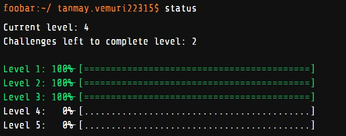

## Greetings from yours truly!

I'm Tanmay Vemuri. I'm a student at Manipal Institute of Technology, Bangalore and as such I'm quite clueless about the world with the confidence that everything will eventually fall into place.

Looking to learn, earn and kick ass, all with my keyboard, trusty laptop and coffee ☕

⚡**Fun fact**: I'm a coffee addict 😅

I'm Currently working on:
  - VisRT: A Metropolis Light Transport Renderer that uses OptiX and optimizes meshes and other stuff before-render, implementing some other optimizations as well.
  - ParallelFin: A finance library/application that implements parallelism and concurrency from the get-go (CPU only)  
  
I'm currently learning: Data structures & Algorithms from GeeksForGeeks.

I’m looking for help with contributing to open source projects.

You can reach me at:
  - Student Mail: tanmay2.mitblr2022@learner.manipal.edu
  - Personal Mail: tanmay.vemuri22315@gmail.com
  - Contact No. : +91 9023414274
  - Mailing Address: 022, HB-2, Manipal Institute of Technology, Bangalore
  - 
 

Here's some information about me, so to speak:

 

Proof for Google Foobar Challenge:

⚡*Fun fact:* I'm still in the challenge and at any time I can start the next challenge, I'm just hoping to be a bit more....*educated* the next time I go for it.
